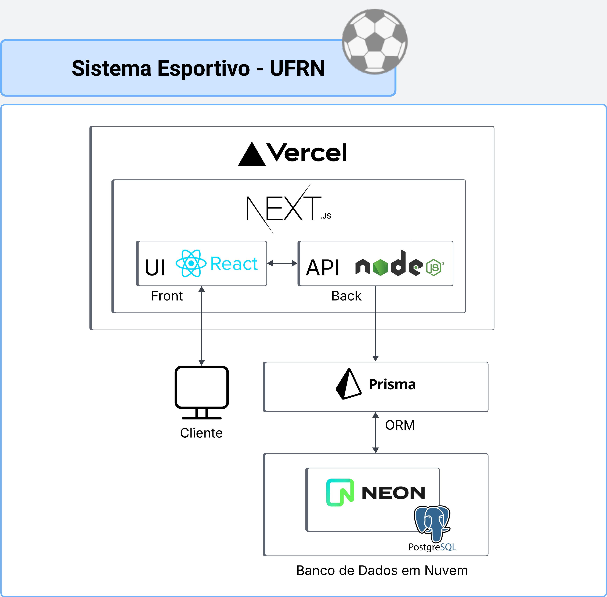

# Visão de Arquitetura — Sistema de Gerenciamento Esportivo da UFRN

## Descrição Geral

O **Sistema de Gerenciamento Esportivo da UFRN** é uma aplicação web desenvolvida para informatizar o processo de inscrições em turmas esportivas, gerenciar listas de espera e acompanhar a assiduidade dos alunos. A plataforma visa substituir planilhas e formulários manuais, oferecendo uma solução moderna e eficiente para alunos e para a diretoria esportiva da universidade.

O objetivo do MVP é **validar a hipótese de que uma solução digital pode melhorar significativamente a experiência dos alunos no processo de inscrição** e, ao mesmo tempo, **fornecer visibilidade e controle mais eficientes para os gestores da secretaria de esportes**.

A arquitetura escolhida privilegia **agilidade no desenvolvimento, integração entre camadas e facilidade de manutenção**, permitindo entregas rápidas e testes com usuários reais sem exigir infraestrutura complexa.

---

## Arquitetura e Tecnologias

A aplicação segue uma **arquitetura fullstack unificada com Next.js**, conforme representado no diagrama abaixo:



---

### Tecnologias Utilizadas

| Camada       | Tecnologia         | Justificativa                                                                 |
|--------------|--------------------|-------------------------------------------------------------------------------|
| Frontend     | **React (via Next.js)** | Framework moderno e componentizado, com ótimo ecossistema.                    |
| Backend      | **API Routes do Next.js (Node.js + TypeScript)** | Unificação do frontend e backend, com tipagem forte e fácil deploy.          |
| ORM          | **Prisma**         | ORM moderno, rápido, com suporte a geração automática de tipos TypeScript.   |
| Banco de Dados | **NeonDB (PostgreSQL)** | Solução escalável e gratuita para prototipagem, com suporte a branchs e autoscaling. |
| Hospedagem   | **Vercel**         | Plataforma com suporte nativo a Next.js, CI/CD automatizado e deploy simples.|

---

## Fluxo de Dados

1. O usuário acessa o sistema via navegador.
2. O frontend React (Next.js) exibe a interface e realiza requisições às API Routes.
3. As API Routes (Node.js/TypeScript) processam as requisições no servidor.
4. O backend se comunica com o Prisma para manipular os dados.
5. O Prisma realiza consultas ou atualizações no banco de dados **NeonDB**.
6. Os dados retornam ao frontend, que os exibe ao usuário.

---

## Estrutura do Repositório

```plaintext
ufrn-sports-subs-manager/
├── docs/                         # Documentação do projeto
├── project/                      # Código principal da aplicação Next.js
│   ├── prisma/                   # Configurações e migrações do Prisma ORM
│   ├── public/                   # Arquivos estáticos (imagens, favicon, etc.)
│   └── src/                      # Código fonte da aplicação
│       ├── actions/              # Server Actions do Next.js
│       │   └── modality/         # Ações específicas para modalidades esportivas
│       ├── app/                  # App Router do Next.js (páginas e layouts)
│       ├── components/           # Componentes React reutilizáveis
│       ├── containers/           # Containers/componentes de nível superior
│       ├── contexts/             # Contextos React para gerenciamento de estado
│       ├── lib/                  # Utilitários e configurações
│       └── types/                # Definições de tipos TypeScript
└── README.md                     # Documentação principal do projeto